# 🎤 Project Presentation Script & Click-by-Click Flow Guide

> **Sir ko samjhane ke liye guide:** Ye document specifically aapki presentation ke liye banaya gaya hai. Isme har ek screen, button click, aur backend/AI response ko detail mein samjhaya gaya hai. Aap ise step-by-step follow karke apna project present kar sakte hain.

---

## 1. 👥 Platform Roles & Permissions (Architecture)

**Scenario:** Sir ko platform ka scale aur security (Role-Based Access Control) samjhana.

*   **Main Purpose / Core Value:** Ek secure, multi-tenant ecosystem dikhana jahan 3 distinct roles (Candidate, Recruiter, Admin) strictly apne specific tools aur dashboards access karte hain. Ye data privacy aur platform integrity ensure karta hai.

```mermaid
graph TD
    %% Main System Node
    System(("AI Smart Job Portal"))
    
    %% The Three Pillars (Roles)
    Candidate["🧑‍🎓 Candidate / Job Seeker"]
    Recruiter["🏢 Recruiter / Company Admin"]
    Admin["👑 Super Admin / Platform Owner"]
    
    System --- Candidate
    System --- Recruiter
    System --- Admin
    
    %% Candidate Capabilities
    Candidate --> C1["Create Profile & Upload Resume"]
    Candidate --> C2["AI Job Search & Recommendations"]
    Candidate --> C3["1-Click Job Apply"]
    Candidate --> C4["Track Application Pipeline"]
    
    %% Recruiter Capabilities
    Recruiter --> R1["Manage Company Profile"]
    Recruiter --> R2["AI-Assisted Job Posting"]
    Recruiter --> R3["AI Score-Based Applicant Shortlisting"]
    Recruiter --> R4["Kanban Candidate Tracking"]
    
    %% Admin Capabilities
    Admin --> A1["Global Dashboard (Metrics)"]
    Admin --> A2["Revenue & Payment Tracking"]
    Admin --> A3["User & Team Role Management"]
    Admin --> A4["Global Job Post & Management"]
    
    %% Visual Styles for clarity
    style System fill:#f9f,stroke:#333,stroke-width:3px
    style Candidate fill:#e2f0d9,stroke:#548235,stroke-width:2px
    style Recruiter fill:#ddebf7,stroke:#2e75b6,stroke-width:2px
    style Admin fill:#fce4d6,stroke:#c55a11,stroke-width:2px
```

---

## 2. 🎓 Candidate Journey (Job Seeker)

**Scenario:** Ek user platform par aata hai aur job search karna chahta hai.

### Step 1: Landing Page & Registration
*   **User Action:** User "Sign Up with Google" ya "Register" button par click karta hai.
*   **System Response:** Backend JWT token generate karta hai aur user ko Dashboard par redirect karta hai.
*   **Main Purpose / Core Value:** Secure JWT authentication aur one-click Google login provide karna taaki user ka time bache aur data completely safe rahe.

### Step 2: AI Onboarding & Profile Setup
*   **User Action:** User **"Upload Resume (PDF)"** button par click karta hai.
*   **System Response:** 
    1. File Cloudinary (Cloud) par upload hoti hai.
    2. `pdf-parse` library PDF se text nikalati hai.
    3. **OpenAI GPT-4o** us text ko read karta hai aur automatically Skills, Experience, aur Job Category (eg. Frontend Developer) nikal kar MongoDB mein save karta hai.
    4. Screen par "Resume Analyzed Successfully" ka toast notification aata hai.
*   **Main Purpose / Core Value:** Ye platform ka core AI feature hai jo manual data entry ko eliminate karta hai. AI profile aur tech stack automatically samajh leta hai.

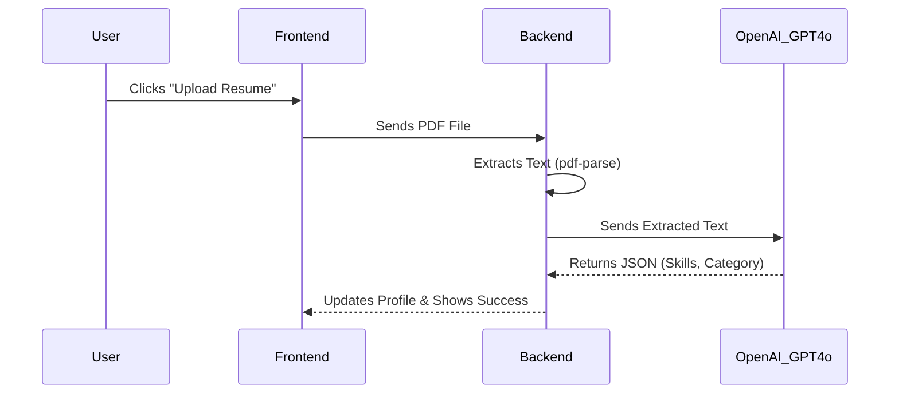

### Step 3: Smart Job Matching & Applying (Top 20 Hiring List)
*   **User Action:** User **"View Recommended Jobs"** par click karta hai.
*   **System Response:** AI thousands of jobs mein se filter karke ek **Top 20 Highly Relevant Jobs** ki list show karta hai. Har job ke aage ek **AI Match Score (e.g., 85%)** hota hai.
*   **User Action:** User specific registered company ki job par **"1-Click Apply"** button dabata hai.
*   **System Response:** Application automatically real company ke recruiter ko send ho jati hai.
*   **Main Purpose / Core Value:** AI ka kaam sirf best matches find karke candidate ko Top 20 list dena hai, taaki candidate apna time bachaye aur real companies un applications ko review kar sakein.

### Step 4: Pre-Screening AI Mock Interview (Confidence Check)
*   **User Action:** User dashboard mein **"Start Mock Interview"** button par click karta hai.
*   **System Response:** AI Avatar camera/mic access leta hai aur candidate ke resume/documents ke basis par normal questions puchhta hai. 
*   **Main Purpose / Core Value:** Ye final interview nahi hai. Ye candidate ka **confidence level check** karne aur basic document screening ki practice ke liye hai taaki wo real company interview ke liye prepare ho sake.

---

## 3. 🎛️ Candidate Dashboard Navigation (UI Walkthrough)

**Scenario:** User successfully login karne ke baad apne main Dashboard par aata hai. Sir ko Dashboard ka UI aur features explain karna hai.

### Sidebar Menu Items & Workflows:

#### 1. 📊 Dashboard (Main View)
*   **What it shows:** Ek comprehensive overview jisme Welcome Banner aur **AI Readiness Score** (e.g., 85/100) hota hai. Saath hi quick stats dikhte hain: *Applications Sent (12)*, *Interviews (4)*, aur *Resume Score (92)*.
*   **Key Feature to highlight:** Niche ek **Application Pipeline** (Kanban status) aur **Application Activity** graph hota hai jisse user apna progress visually track kar sake.
*   **Main Purpose / Core Value:** Candidate ko ek unified control center dena jahan uski poori application journey aur performance ek hi dashboard par track ho sake.

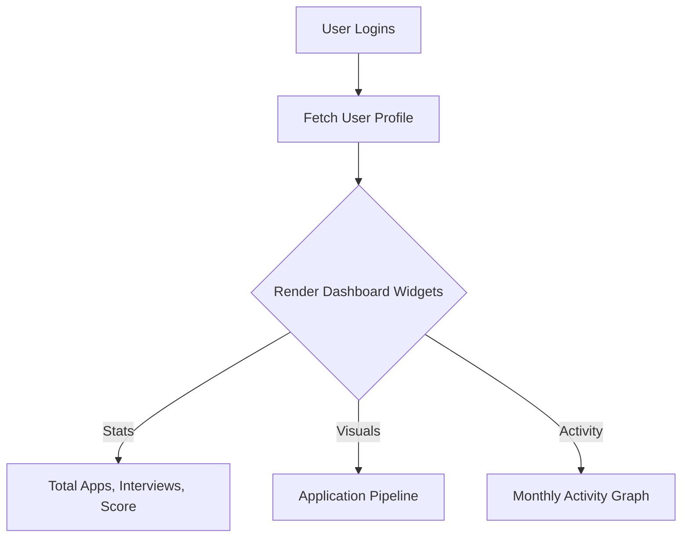

#### 2. 📄 Resume Analysis
*   **User Action:** Sidebar mein "Resume Analysis" par click karta hai.
*   **What it shows:** Upload kiye gaye resume ka deep breakdown. Top Skills Detected (e.g., React, Node.js) aur Areas for Improvement (e.g., System Design) dikhte hain.
*   **Buttons:** **"Improve Resume"** (AI suggestions apply karne ke liye) aur **"Re-analyze"** (new version analyze karne ke liye).
*   **Main Purpose / Core Value:** Resume ko ATS-friendly banane ke liye OpenAI se direct, actionable feedback dena taaki rejection rate kam ho.

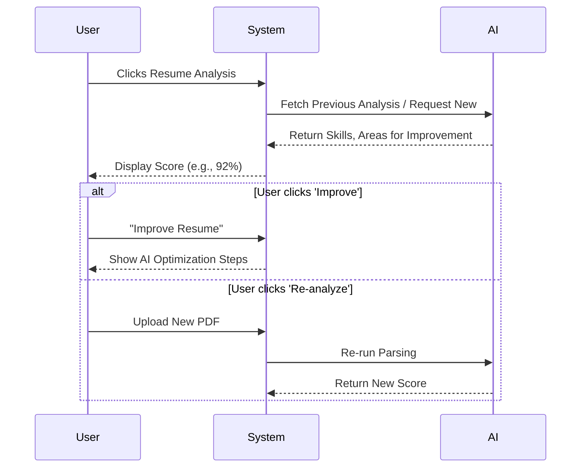

#### 3. 🎯 Job Matches
*   **What it shows:** **Top AI Job Matches** ki ranked list (e.g., Senior AI Engineer, Fullstack Developer).
*   **Main Purpose / Core Value:** Candidate ka time bachane ke liye AI-driven automatic job suggestions dikhana jo uski profile se best match karte hon.

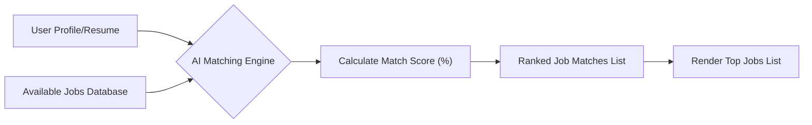

#### 4. 📋 Applications
*   **What it shows:** User track kar sakta hai ki usne kin jobs par apply kiya hai aur unka real-time status (Applied, Shortlisted, Interview) kya hai.

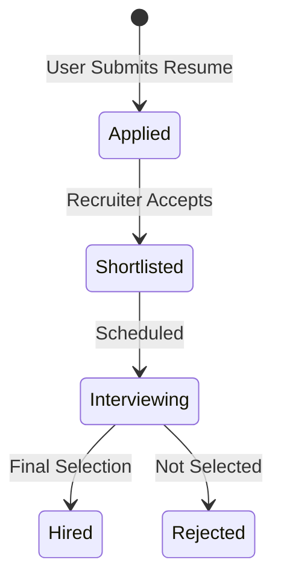

#### 5. 💡 AI Suggestions (AI Coaching)
*   **What it shows:** Actionable guidance jaise "Optimize your LinkedIn" (kyunki profile mein keywords missing hain) ya "Practice System Design".
*   **Main Purpose / Core Value:** Platform ko sirf ek job portal tak seemit na rakh kar ek "Personal Career Coach" banana jo actionable next steps guide kare.

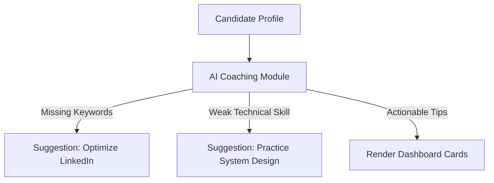

#### 6. 🎤 Mock Interview
*   **What it does:** Live camera aur mic ke through AI Avatar ke sath technical interview practice start karne ka portal.

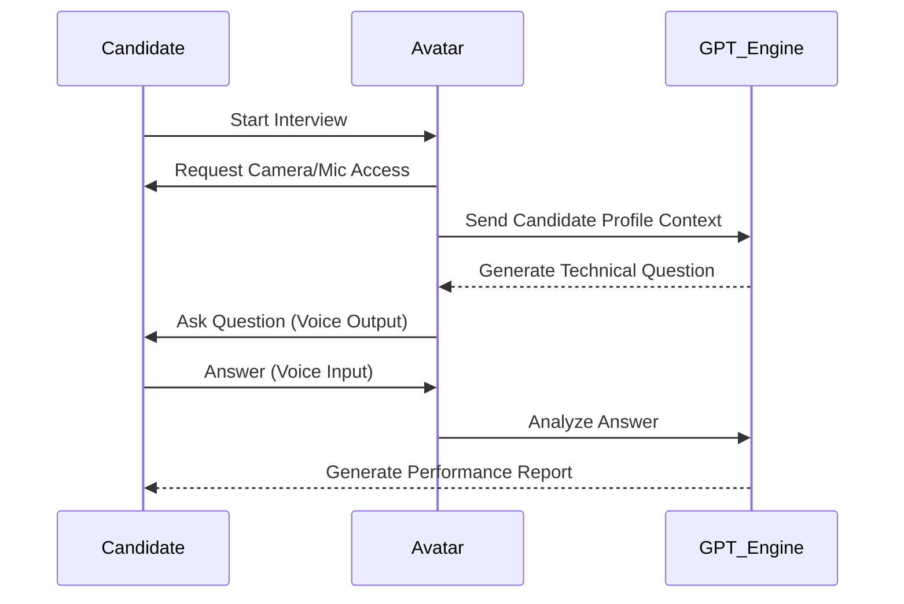

#### 7. 📁 Portfolio Builder
*   **What it does:** Resume ko complement karne ke liye professional GitHub README ya portfolio generate karne ka AI tool.

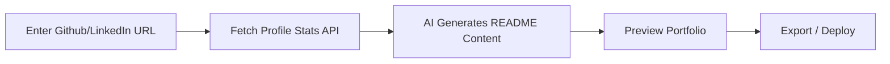

#### 8. ⚙️ Settings
*   **What it does:** Profile update, password change, aur account limits manage karne ki jagah.

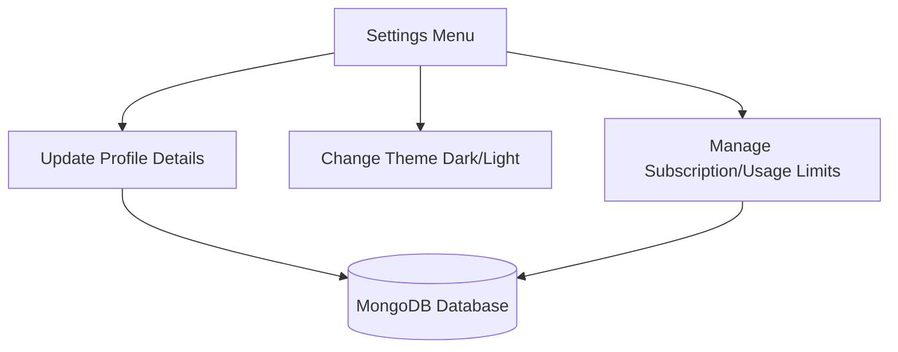

#### 9. 🤖 "Ask AI" (Bottom Button)
*   **User Action:** Sidebar ke bottom mein "Ask AI" button par click karta hai.
*   **What it does:** Ek instant chat window open hoti hai jahan user directly GPT-4o se career ya tech related doubts puch sakta hai.
*   **Main Purpose / Core Value:** Platform ke andar hi ek ChatGPT jaisa built-in assistant provide karna taaki user apne career doubts bina platform leave kiye clear kar sake.

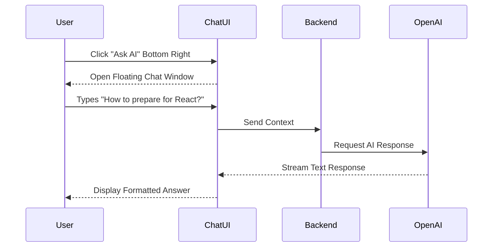

---

## 4. 🏢 Recruiter Journey (Hiring Manager)

**Scenario:** Ek HR manager platform par naya job post karne aur candidates ko filter karne aata hai.

### Step 1: AI-Powered Job Posting
*   **User Action:** Recruiter **"Post New Job"** par click karta hai. Title mein likhta hai "React Developer" aur **"Generate with AI"** button dabata hai.
*   **System Response:** OpenAI automatically poori Job Description (Responsibilities, Requirements) likh deta hai. Recruiter "Publish" par click karta hai.
*   **Main Purpose / Core Value:** Recruiter ka 90% time bachana by automating the Job Description writing process using generative AI.

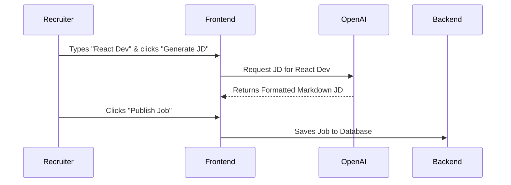

### Step 2: Applicant Tracking (Kanban Board)
*   **User Action:** Recruiter **"View Applicants"** par click karta hai.
*   **System Response:** Ek visual Drag-and-Drop Kanban Board khulta hai (Applied ➡️ Shortlisted ➡️ Interviewing ➡️ Hired).
*   **Main Purpose / Core Value:** Traditional boring tables ko replace karke ek modern, visual Trello/Jira jaisa Kanban board dena better pipeline management ke liye.

### Step 3: AI Applicant Ranking & Shortlisting
*   **User Action:** Recruiter Kanban board dekhta hai. "Applied" column mein candidates automatically unke **AI Match Score (High to Low)** ke hisaab se sorted rehte hain.
*   **User Action:** Recruiter highest score wale candidate ka card drag karke "Shortlisted" column mein drop karta hai.
*   **System Response:** Database update hota hai aur Candidate ko real-time mein **Socket.io** ke through ek notification ("Ting!") chala jata hai ki "You have been shortlisted!".
*   **Main Purpose / Core Value:** Manual screening ko eliminate karke AI ranking lana, aur live Socket.io notifications ke through candidates ko instant updates dena.

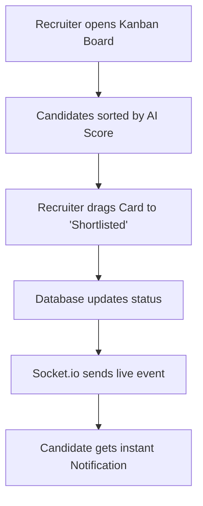

### Step 4: Face-to-Face Interview Scheduling (Google Meet)
*   **User Action:** Recruiter (Company) candidate ko select karke apne portal se **"Schedule Interview"** button dabata hai.
*   **System Response:** System candidate ko ek exact Date/Time (e.g., "Tomorrow 10 AM") aur **Google Meet Link** send kar deta hai.
*   **Main Purpose / Core Value:** AI final interview nahi leta. AI ka kaam sirf top candidates filter karna aur pre-screening karna hai. Final hiring decision actual face-to-face Google Meet interview ke baad Recruiter (Company) khud leta hai.

### Step 5: Post-Interview Feedback & Final Decision
*   **User Action:** Google Meet interview hone ke baad, Recruiter portal par wapas aakar candidate ke liye **"Submit Feedback"** form bharta hai aur card ko **"Hired"** ya **"Rejected"** column mein daalta hai.
*   **System Response:** Candidate ko turant ek notification milti hai jisme detailed feedback (e.g. Communication: 9/10, Tech Skills: 8/10) aur unka final result likha hota hai.
*   **Main Purpose / Core Value:** Ek transparent hiring process banana jahan candidate ghost na ho, aur use exactly pata ho ki uski performance kaisi thi.

---

## 5. 👑 Admin & Super Admin Journey

**Scenario:** Platform ka owner platform ki health aur revenue check kar raha hai.

### Step 1: Platform Monitoring
*   **User Action:** Admin apne **Management Portal** mein login karta hai.
*   **System Response:** Dashboard open hota hai jahan total active users, total jobs posted, aur Premium subscriptions ka graph show hota hai.
*   **Main Purpose / Core Value:** Admin ko ek "god-eye view" dashboard dena aur frontend vs admin portal ki boundaries ko securely maintain karna.

### Step 2: Role Management
*   **User Action:** Super Admin **"Team Management"** par click karta hai aur kisi naye user ko "Sub-Admin" ka role assign karke "Save" button dabata hai.
*   **System Response:** Database mein role update hota hai (Role-Based Access Control - RBAC).
*   **Main Purpose / Core Value:** Platform ki security aur control ke liye strict Role-Based Access Control (RBAC) implement karna.

---

## 💡 Core Pitch Summary (Key Takeaways)
Presentation conclude karte waqt in 3 major impact points par focus karein:
1. **End-to-End Automation:** Platform 90% manual kaam (form filling, resume reading, shortlisting) ko AI ke through automate karta hai.
2. **Speed & Efficiency:** Kanban board aur AI ranking se recruitment process 10x fast ho jata hai.
3. **Advanced Technology:** OpenAI, Next.js, aur live WebSockets (Socket.io) ka use karke ek production-ready modern architecture build kiya gaya hai.
