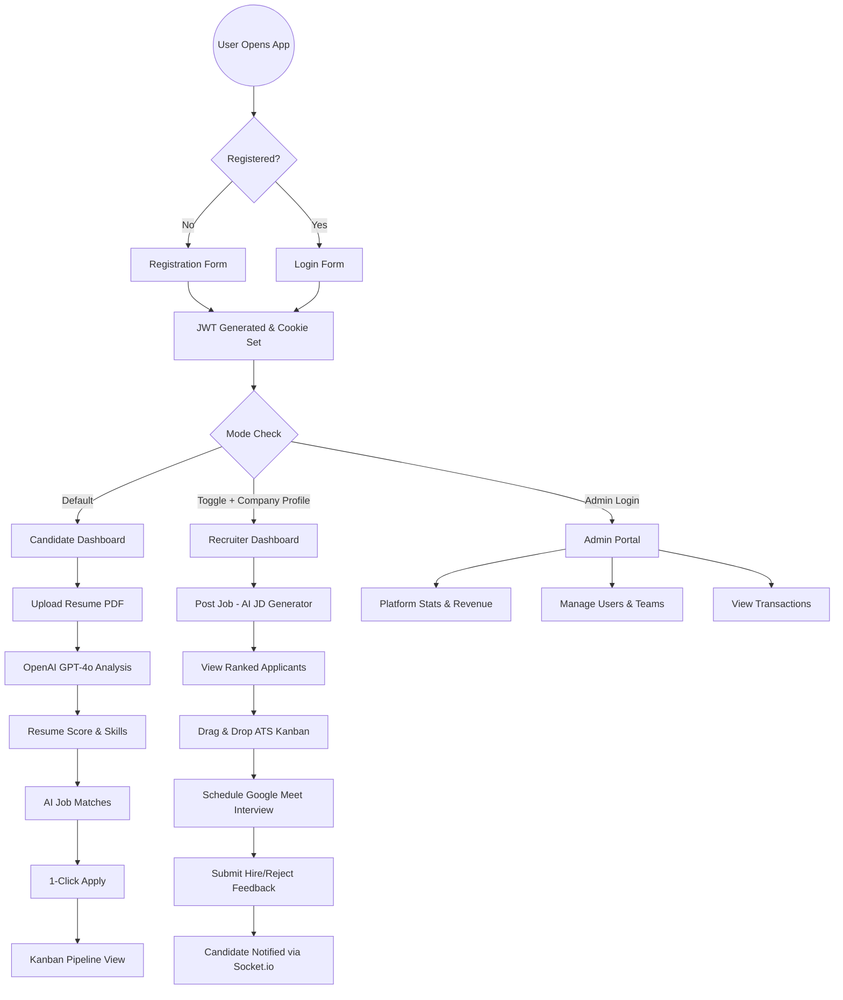
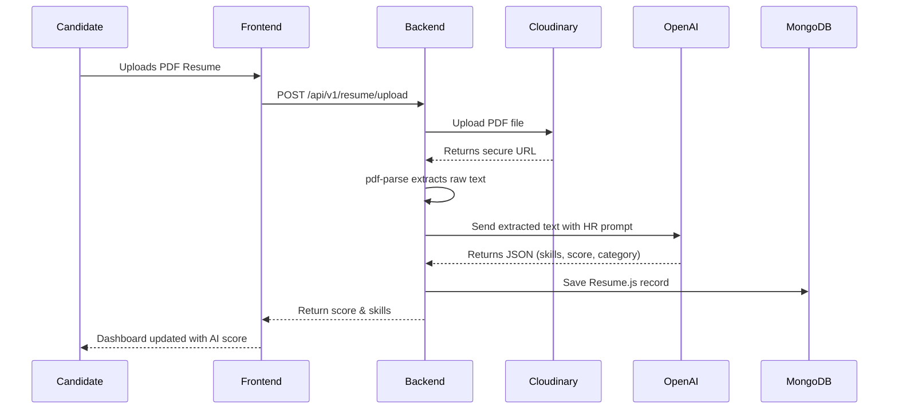
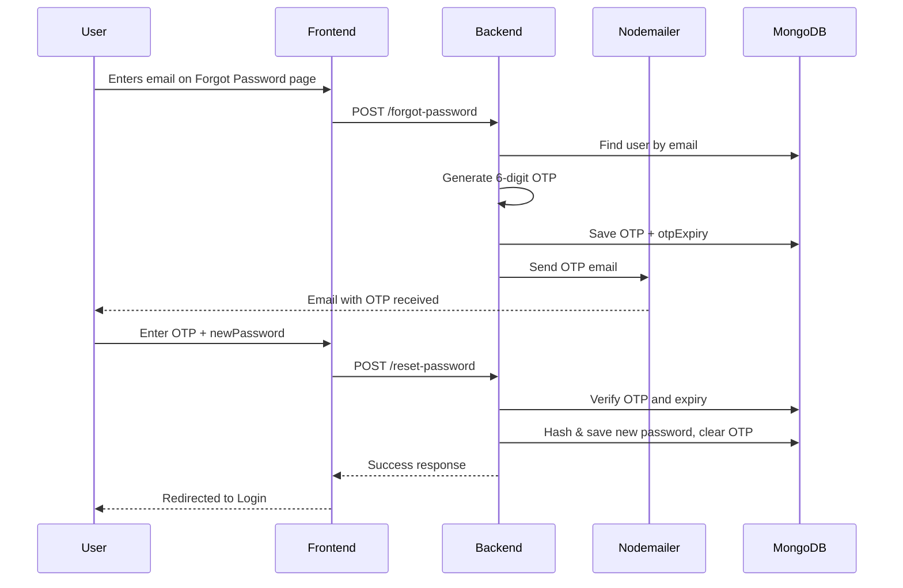
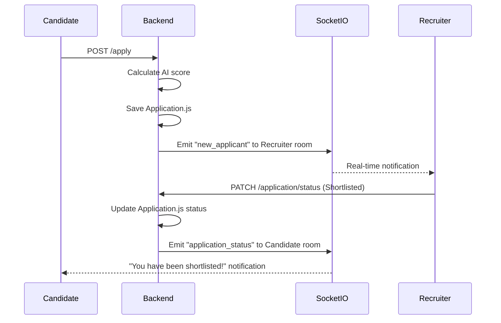

# 📋 Software Requirements Specification (SRS)
## AI-Based Multi-Category Smart Job Portal
### Version 2.0 | Status: Final | Year: 2026

---

## 1. Introduction

### 1.1 Purpose
This Software Requirements Specification (SRS) document defines the complete functional and non-functional requirements for the **AI-Based Multi-Category Smart Job Portal**. This document serves as the single source of truth for all stakeholders — developers, designers, testers, and project managers.

### 1.2 Project Scope
This platform is a dual-sided AI hiring ecosystem designed to:
- Help **Candidates** find relevant jobs using AI-powered resume analysis and smart matching.
- Help **Recruiters** source, rank, and hire the best candidates using AI automation.
- Allow **Super Admins** to manage the entire platform, revenue, and users.

### 1.3 Definitions & Acronyms

| Term | Definition |
|---|---|
| SRS | Software Requirements Specification |
| AI | Artificial Intelligence (OpenAI GPT-4o) |
| ATS | Applicant Tracking System |
| JWT | JSON Web Token (Authentication mechanism) |
| OTP | One-Time Password (6-digit, 10-minute expiry) |
| CRUD | Create, Read, Update, Delete |
| API | Application Programming Interface |
| UI | User Interface |
| UX | User Experience |

### 1.4 Intended Audience

| Audience | Purpose |
|---|---|
| Backend Developers | Implement API, Models, Controllers |
| Frontend Developers | Build Next.js UI based on specifications |
| QA Engineers | Write test cases from functional requirements |
| Project Manager | Track project progress |
| Stakeholders | Validate features and approve delivery |

---

## 2. Overall System Description

### 2.1 Product Perspective
The system is a web-based application with three separate portals:
1. **Frontend (Candidate + Recruiter):** `localhost:3000`
2. **Admin Portal (Super Admin):** `localhost:3001`
3. **Backend REST API:** `localhost:5000/api/v1/`

### 2.2 Product Functions (High-Level)
- User Registration & Authentication (Email + Google OAuth)
- AI Resume Upload, Parsing & Scoring
- AI-Powered Job Matching & Recommendations
- One-Click Job Application & ATS Kanban Tracking
- Recruiter Dashboard: Post Jobs, View Applicants, Hire
- AI Mock Interview (Practice + Official mode)
- Real-time Chat (Socket.io) between Recruiter & Candidate
- Super Admin: Platform Analytics, Revenue, User Management
- Subscription & Payment System (Free / Pro / Enterprise)

### 2.3 User Classes & Characteristics

#### 2.3.1 Unified User (Candidate Mode — Default)
- Any registered user is a candidate by default.
- Can upload resume, search/apply for jobs, track applications.
- Can take AI Mock Interviews and view AI coaching tips.

#### 2.3.2 Unified User (Recruiter / Hiring Mode)
- Same account — user toggles to "Hiring Mode" via the top navbar.
- Must complete "Company Profile" onboarding before accessing recruiter features.
- Can post jobs, view ranked applicants, manage ATS pipeline.

#### 2.3.3 Super Admin
- Separate portal access (admin.aijobportal.com).
- Manages all users, companies, revenue, and platform settings.

### 2.4 Operating Environment
- **Browser Support:** Chrome, Firefox, Safari, Edge (latest versions)
- **Responsive:** Mobile, Tablet, Desktop
- **Backend:** Node.js v18+, Express.js
- **Database:** MongoDB Atlas (Cloud)
- **Hosting:** Frontend → Vercel | Backend → Railway/Render

### 2.5 Design & Implementation Constraints
- All API routes must follow `/api/v1/` prefix.
- All database passwords must be hashed via `bcryptjs` (salt rounds = 10).
- OTPs expire in exactly 10 minutes.
- File uploads are limited to PDF and image MIME types only.
- JWT tokens are stored in HTTP-only cookies (not localStorage).

---

## 3. System Architecture

### 3.1 Architecture Type
**Client-Server Architecture** (Decoupled Frontend & Backend)

```
┌──────────────────────────────────────────┐
│         CLIENTS (Browsers)               │
│   [Frontend - Candidate/Recruiter]       │
│   [Admin Portal - Super Admin]           │
│   Next.js + TypeScript + TailwindCSS 4   │
└─────────────────┬────────────────────────┘
                  │ HTTP REST API + Socket.io
┌─────────────────▼────────────────────────┐
│       SERVER (Node.js + Express.js)       │
│   Auth | Job | AI | Payment | Admin       │
└──────┬──────────┬──────────┬─────────────┘
       ▼          ▼          ▼
  MongoDB     Cloudinary  OpenAI GPT-4o
   Atlas      (Files)     (AI Engine)
```

### 3.2 Tech Stack

| Layer | Technology |
|---|---|
| Frontend & Admin | Next.js 14 (App Router), TypeScript, TailwindCSS 4 |
| State Management | Zustand + TanStack React Query |
| Backend | Node.js, Express.js |
| Database | MongoDB Atlas + Mongoose |
| Authentication | JWT (HTTP-only cookie) + Google OAuth |
| File Storage | Multer + Cloudinary |
| AI Engine | OpenAI GPT-4o API |
| Real-time | Socket.io |
| Email | Nodemailer + otp-generator |
| Payments | Stripe (International) / Razorpay (India) |

---

## 4. Functional Requirements

### 4.1 Authentication Module

#### FR-AUTH-01: User Registration
- **Description:** New user can register with full name, email, country code, phone number, password, and confirm password.
- **Trigger:** POST `/api/v1/user/register`
- **Inputs:** `fullname`, `email`, `countryCode`, `phoneNumber`, `password`, `confirmPassword`
- **Processing:** Validate inputs → Check email uniqueness → Hash password (bcrypt) → Save to DB → Return JWT.
- **Output:** `{ success: true, data: { user, token } }`
- **Error Cases:** Duplicate email (400), Password mismatch (400).

#### FR-AUTH-02: User Login
- **Description:** Existing user logs in via email and password.
- **Trigger:** POST `/api/v1/user/login`
- **Inputs:** `email`, `password`
- **Processing:** Find user → Compare bcrypt hash → Generate JWT → Set HTTP-only cookie.
- **Output:** `{ success: true, data: { user, token } }`
- **Error Cases:** User not found (404), Wrong password (401).

#### FR-AUTH-03: Google OAuth Login
- **Description:** User can login or register via Google account.
- **Trigger:** POST `/api/v1/user/google-login`
- **Inputs:** `idToken` (from Google)
- **Processing:** Verify Google token → Check if user exists → Create if new → Return JWT.

#### FR-AUTH-04: Forgot Password (OTP)
- **Description:** User requests a 6-digit OTP to their email.
- **Trigger:** POST `/api/v1/user/forgot-password`
- **Inputs:** `email`
- **Processing:** Find user → Generate 6-digit OTP → Set `otp` + `otpExpiry` (10 min) in DB → Send email via Nodemailer.
- **Error Cases:** Email not registered (404).

#### FR-AUTH-05: Reset Password
- **Description:** User resets password using OTP received in email.
- **Trigger:** POST `/api/v1/user/reset-password`
- **Inputs:** `email`, `otp`, `newPassword`, `confirmPassword`
- **Processing:** Find user → Verify OTP → Check expiry → Hash new password → Clear OTP from DB → Save.
- **Error Cases:** Invalid OTP (400), Expired OTP (400), Password mismatch (400).

#### FR-AUTH-06: Logout
- **Description:** User logs out and JWT cookie is cleared.
- **Trigger:** POST `/api/v1/user/logout`

---

### 4.2 Candidate Module

#### FR-CAND-01: Profile Management
- Candidate can update name, bio, skills, experience, and profile photo.
- Profile photo is uploaded to Cloudinary.
- **Trigger:** PUT `/api/v1/user/profile/update`

#### FR-CAND-02: Resume Upload
- Candidate uploads PDF resume.
- `multer` processes it → stored to Cloudinary → URL saved in `User.resume`.
- **Trigger:** POST `/api/v1/resume/upload`

#### FR-CAND-03: AI Resume Analysis
- After upload, `pdf-parse` extracts text → text sent to OpenAI GPT-4o.
- AI returns: `{ skills, experience, category, summary, score }`.
- Score (0-100) and skills are saved in `Resume.js` model.
- **Trigger:** POST `/api/v1/resume/analyze`

#### FR-CAND-04: Job Search & Filters
- Candidate can search jobs by title, location, category, experience, and work type.
- **Trigger:** GET `/api/v1/job/all?title=React&location=Remote`

#### FR-CAND-05: One-Click Job Application
- Candidate applies to a job with resume auto-attached.
- AI compatibility score is calculated and saved in `Application.js`.
- **Trigger:** POST `/api/v1/application/apply`
- **Inputs:** `jobId`

#### FR-CAND-06: Application Pipeline (Kanban View)
- Candidate views all their applications grouped by ATS status.
- Statuses: `Applied → Shortlisted → Interview → Hired / Rejected`
- **Trigger:** GET `/api/v1/application/my-applications`

#### FR-CAND-07: Candidate Dashboard Stats
- Returns: `applicationsSent`, `interviews`, `resumeScore`, `activityByDay[]`.
- **Trigger:** GET `/api/v1/dashboard/candidate`

#### FR-CAND-08: AI Mock Interview
- **Practice Mode:** Unlimited sessions, no profile impact.
- **Official Mode:** Strict 10-15 min session. Score saved to `MockInterview.js`.
- AI generates resume-driven questions and evaluates answers.
- Result: `confidenceScore`, `technicalScore`, `aiFeedback`.
- **Trigger:** POST `/api/v1/interview/start`, POST `/api/v1/interview/submit`

#### FR-CAND-09: AI Coaching Tips
- Based on resume weak areas, AI suggests action items.
- **Trigger:** GET `/api/v1/ai/coaching`

#### FR-CAND-10: Real-time Chat
- Candidate can chat with recruiter via Socket.io.
- Messages stored in `Message.js`.
- **Socket Event:** `send_message`, `new_message`

---

### 4.3 Recruiter (Hiring Mode) Module

#### FR-REC-01: Hiring Mode Onboarding
- First-time toggle shows "Create Company Profile" form.
- **Fields:** Company Name, Logo, Website, Industry, Location, Bio.
- `hasCompanyProfile` flag set to `true` in `User.js` after submission.
- **Trigger:** POST `/api/v1/company/setup`

#### FR-REC-02: Post a Job
- Recruiter posts a job with title, description, requirements, salary, location.
- Optional: AI generates full Job Description from just the title.
- **Trigger:** POST `/api/v1/job/post`

#### FR-REC-03: View Ranked Applicants
- All applicants for a job, sorted descending by AI score (0-100%).
- **Trigger:** GET `/api/v1/application/job/:jobId`

#### FR-REC-04: ATS Kanban Pipeline
- Drag & drop interface to update applicant status.
- Statuses: `Applied → Shortlisted → Interview → Hired / Rejected`.
- **Trigger:** PATCH `/api/v1/application/status`
- **Socket Event:** `application_status` emitted to candidate on change.

#### FR-REC-05: Schedule Interview
- Recruiter sends date/time and Google Meet link to candidate.
- **Socket Event:** `interview_scheduled` emitted to candidate.
- **Trigger:** POST `/api/v1/application/schedule-interview`

#### FR-REC-06: Submit Post-Interview Feedback
- After interview, recruiter submits: `Hired / Rejected / In Progress`.
- If Rejected: dropdown for reason (Skills Gap, Cultural Fit, etc.).
- AI converts reason to professional feedback for candidate.
- **Socket Event:** `interview_feedback` emitted to candidate.

#### FR-REC-07: Recruiter Dashboard Stats
- Returns: `activeJobs`, `totalCandidates`, `hired`, `hiringPipeline[]`.
- **Trigger:** GET `/api/v1/dashboard/recruiter`

#### FR-REC-08: Direct Messaging
- Real-time Socket.io chat with candidates.
- **Socket Events:** `send_message`, `new_message`

---

### 4.4 Super Admin Module

#### FR-ADMIN-01: Platform Dashboard Stats
- Returns: `totalUsers`, `activeRecruiters`, `monthlyRevenue`, `premiumUsers`.
- Includes `revenueByMonth[]` array for Revenue Growth line graph.
- **Trigger:** GET `/api/v1/admin/dashboard-stats`

#### FR-ADMIN-02: User Management
- View, search, filter, and deactivate all users.
- **Trigger:** GET `/api/v1/admin/users`

#### FR-ADMIN-03: Transaction History
- View all payments: user, plan, amount, date, status (Successful/Failed).
- **Trigger:** GET `/api/v1/admin/transactions`

#### FR-ADMIN-04: Job Management (Bulk CSV Import)
- Admin can manually post jobs or bulk import via CSV file.
- CSV template downloadable. Processed by backend and inserted to `Job.js`.

#### FR-ADMIN-05: AI Insights Widget
- Revenue forecast, churn alert, growth tips generated by AI.
- **Trigger:** GET `/api/v1/admin/ai-insights`

---

### 4.5 Payment & Subscription Module

#### FR-PAY-01: Subscription Plans
| Plan | Price | Key Limits |
|---|---|---|
| Free | ₹0 | 10 applications/month, 1 resume analysis |
| Pro | ₹999/month | Unlimited applications, 5 AI analyses |
| Enterprise | ₹2999/month | All Pro features + Priority listing |

#### FR-PAY-02: Payment Processing
- Stripe handles international payments.
- Razorpay handles Indian payments.
- On success: `User.isPremium = true`, `User.paymentId` saved.
- Transaction saved to `Transaction.js`.
- **Trigger:** POST `/api/v1/payment/checkout`

#### FR-PAY-03: Stripe Webhook
- Stripe sends payment status update events to backend.
- Verified via `STRIPE_WEBHOOK_SECRET` before processing.
- **Trigger:** POST `/api/v1/payment/webhook`

---

## 5. Non-Functional Requirements

### 5.1 Performance
| Requirement | Target |
|---|---|
| API Response Time | < 300ms for standard requests |
| AI Analysis Time | < 5 seconds (OpenAI API) |
| Page Load Time | < 2 seconds (Vercel CDN) |
| Concurrent Users | Minimum 500 simultaneous users |
| Socket.io Latency | < 100ms for real-time events |

### 5.2 Security
| Measure | Implementation |
|---|---|
| Password Hashing | bcryptjs, salt rounds = 10 |
| JWT Auth | HTTP-only cookie, 7-day expiry |
| HTTP Security Headers | helmet middleware |
| CORS | Whitelist only FRONTEND_URL and ADMIN_URL |
| Rate Limiting | express-rate-limit (100 req/15min per IP) |
| OTP Expiry | 10 minutes, cleared after use |
| File Upload | Only PDF and image MIME types accepted |
| Payment Webhook | Verified with STRIPE_WEBHOOK_SECRET |
| Error Responses | Stack traces never exposed in production |

### 5.3 Reliability
- **Uptime:** 99.5% monthly availability.
- **Error Handling:** Global `errorHandler.js` catches all unhandled errors.
- **Database:** MongoDB Atlas with automatic backups.

### 5.4 Scalability
- Stateless JWT authentication allows horizontal scaling.
- Cloudinary handles file storage independently.
- Socket.io can be scaled with Redis adapter if needed.

### 5.5 Usability
- Mobile-first responsive design.
- WCAG 2.1 accessibility compliance.
- Dual dashboard theme: Blue (Candidate Mode), Purple (Recruiter Mode).
- Toast notifications via `sonner` for all user actions.

---

## 6. Socket.io Real-Time Events

| Event | Direction | Payload | Description |
|---|---|---|---|
| `connection` | Client → Server | `{ userId }` | User joins personal room on login |
| `new_applicant` | Server → Recruiter | `{ jobId, candidateName }` | New application received |
| `application_status` | Server → Candidate | `{ jobId, newStatus }` | ATS status changed |
| `interview_scheduled` | Server → Candidate | `{ dateTime, meetLink }` | Interview scheduled |
| `send_message` | Client → Server | `{ receiverId, content }` | User sends DM |
| `new_message` | Server → User | `{ senderName, content }` | New DM received |
| `interview_feedback` | Server → Candidate | `{ finalStatus, feedback }` | Post-interview result |
| `job_posted` | Server → Candidates | `{ jobId, jobTitle }` | New matching job posted |

---

## 7. API Endpoints Summary

### Auth Routes — `/api/v1/user`
| Method | Endpoint | Auth | Description |
|---|---|---|---|
| POST | `/register` | ❌ | Register new user |
| POST | `/login` | ❌ | Login + JWT |
| POST | `/google-login` | ❌ | Google OAuth |
| POST | `/logout` | ✅ | Logout user |
| POST | `/forgot-password` | ❌ | Send OTP to email |
| POST | `/reset-password` | ❌ | Verify OTP + set password |
| PUT | `/profile/update` | ✅ | Update user profile |

### Job Routes — `/api/v1/job`
| Method | Endpoint | Auth | Description |
|---|---|---|---|
| POST | `/post` | ✅ | Recruiter posts a job |
| GET | `/all` | ❌ | List all jobs (filterable) |
| GET | `/:id` | ❌ | Get single job details |
| PUT | `/:id` | ✅ | Update job |
| DELETE | `/:id` | ✅ | Delete job |
| GET | `/matches` | ✅ | AI-matched jobs for candidate |

### Application Routes — `/api/v1/application`
| Method | Endpoint | Auth | Description |
|---|---|---|---|
| POST | `/apply` | ✅ | Apply to a job |
| GET | `/my-applications` | ✅ | Candidate's applications |
| GET | `/job/:jobId` | ✅ | Recruiter views applicants |
| PATCH | `/status` | ✅ | Update ATS Kanban status |
| POST | `/schedule-interview` | ✅ | Schedule interview |

### Resume Routes — `/api/v1/resume`
| Method | Endpoint | Auth | Description |
|---|---|---|---|
| POST | `/upload` | ✅ | Upload PDF resume |
| POST | `/analyze` | ✅ | Run AI analysis |
| GET | `/latest` | ✅ | Get latest resume score |
| GET | `/history` | ✅ | Resume upload history |

### Dashboard Routes — `/api/v1/dashboard`
| Method | Endpoint | Auth | Description |
|---|---|---|---|
| GET | `/candidate` | ✅ | Candidate dashboard stats |
| GET | `/recruiter` | ✅ | Recruiter dashboard stats |

### Admin Routes — `/api/v1/admin`
| Method | Endpoint | Auth | Description |
|---|---|---|---|
| GET | `/dashboard-stats` | ✅ Admin | Platform-wide stats |
| GET | `/users` | ✅ Admin | All users list |
| GET | `/transactions` | ✅ Admin | Payment history |
| GET | `/ai-insights` | ✅ Admin | AI revenue insights |

### Payment Routes — `/api/v1/payment`
| Method | Endpoint | Auth | Description |
|---|---|---|---|
| POST | `/checkout` | ✅ | Initiate Stripe/Razorpay |
| POST | `/webhook` | ❌ | Stripe webhook handler |

---

## 8. Database Models Summary

| Model | Key Fields | Purpose |
|---|---|---|
| `User.js` | fullname, email, countryCode, phoneNumber, password, otp, otpExpiry, hasCompanyProfile, isPremium | Unified user |
| `Company.js` | name, logo, website, industry, location, bio, userId | Hiring Mode profile |
| `Job.js` | title, description, salary, location, category, companyId, requirements[] | Job postings |
| `Application.js` | userId, jobId, aiScore, status, coverLetter, appliedAt | Job applications + ATS |
| `Resume.js` | userId, fileUrl, score, topSkills[], areasForImprovement[], createdAt | AI resume analysis |
| `Message.js` | senderId, receiverId, content, readStatus, timestamp | Real-time DM chat |
| `MockInterview.js` | userId, resumeId, confidenceScore, technicalScore, aiFeedback, duration, date | AI interview sessions |
| `Transaction.js` | userId, amount, plan, status, date | Payment history |
| `Subscription.js` | userId, planType, startDate, endDate, isActive | Active plan details |
| `Billing.js` | companyId, invoiceUrl, amount, dueDate, status | Company billing records |

---

## 9. Environment Variables

```env
PORT=5000
NODE_ENV=development
MONGO_URI=mongodb+srv://<user>:<pass>@cluster.mongodb.net/ai_job_portal
JWT_SECRET=your_jwt_secret
JWT_EXPIRES_IN=7d
EMAIL_USER=your@gmail.com
EMAIL_PASS=your_app_password
CLOUDINARY_CLOUD_NAME=your_cloud_name
CLOUDINARY_API_KEY=your_key
CLOUDINARY_API_SECRET=your_secret
OPENAI_API_KEY=sk-proj-xxxx
GOOGLE_CLIENT_ID=your_google_client_id
STRIPE_SECRET_KEY=sk_test_xxxx
STRIPE_WEBHOOK_SECRET=whsec_xxxx
FRONTEND_URL=http://localhost:3000
ADMIN_URL=http://localhost:3001
```

---

## 10. Subscription Plans

| Feature | Free | Pro (₹999/mo) | Enterprise (₹2999/mo) |
|---|---|---|---|
| Job Applications | 10/month | Unlimited | Unlimited |
| AI Resume Analysis | 1 time | 5/month | Unlimited |
| AI Mock Interviews | 1 demo | 10/month | Unlimited |
| AI Job Match Score | ❌ | ✅ | ✅ |
| Direct Messaging | ❌ | ✅ | ✅ |
| Priority in Search | ❌ | ❌ | ✅ |
| Account Manager | ❌ | ❌ | ✅ |

---

## 11. Glossary

| Term | Meaning |
|---|---|
| ATS | Applicant Tracking System — Kanban board for tracking candidate hiring stages |
| GPT-4o | OpenAI's most advanced language model used for AI features |
| Kanban | Visual drag-and-drop board for managing workflow stages |
| OTP | One-Time Password — 6-digit code for secure password reset |
| Unified User | A single account that can act as both Candidate and Recruiter |
| Hiring Mode | Recruiter view activated by toggling the mode switch in the navbar |
| Socket.io | Real-time bidirectional event-based communication library |
| HTTP-only Cookie | A cookie that cannot be accessed by JavaScript, preventing XSS attacks |

---

## 12. Use Case Descriptions

### UC-01: User Registration
| Field | Detail |
|---|---|
| **Use Case ID** | UC-01 |
| **Actor** | New User |
| **Pre-condition** | User is not registered |
| **Trigger** | User clicks "Sign Up Free" |
| **Main Flow** | 1. Fill form (fullname, email, countryCode, phoneNumber, password, confirmPassword) → 2. Validate fields → 3. Check email uniqueness → 4. Hash password (bcrypt) → 5. Save to DB → 6. Generate JWT → 7. Redirect to Candidate Dashboard |
| **Alternate Flow** | Email exists → 400 "User already exists" |
| **Post-condition** | Account created; user logged in |

### UC-02: AI Resume Analysis
| Field | Detail |
|---|---|
| **Use Case ID** | UC-02 |
| **Actor** | Candidate |
| **Pre-condition** | Candidate is logged in |
| **Trigger** | Candidate clicks "Analyze Resume" |
| **Main Flow** | 1. Upload PDF → 2. Multer stores in memory → 3. Upload to Cloudinary → 4. pdf-parse extracts text → 5. Send to OpenAI GPT-4o → 6. AI returns `{skills, experience, score}` → 7. Save to Resume.js → 8. Update dashboard |
| **Alternate Flow** | PDF corrupted → "Unable to parse resume" error |
| **Post-condition** | Resume score visible on dashboard |

### UC-03: One-Click Job Application
| Field | Detail |
|---|---|
| **Use Case ID** | UC-03 |
| **Actor** | Candidate |
| **Pre-condition** | Candidate logged in, resume uploaded |
| **Trigger** | Candidate clicks "Apply Now" |
| **Main Flow** | 1. Check if already applied → 2. Calculate AI score → 3. Save Application.js → 4. Emit `new_applicant` Socket event to Recruiter → 5. Candidate pipeline updated |
| **Alternate Flow** | Already applied → "You have already applied" toast |
| **Post-condition** | Application saved; recruiter notified |

### UC-04: Hiring Mode Onboarding
| Field | Detail |
|---|---|
| **Use Case ID** | UC-04 |
| **Actor** | Unified User (first-time Recruiter) |
| **Pre-condition** | `hasCompanyProfile = false` |
| **Trigger** | User toggles "Switch to Hiring Mode" |
| **Main Flow** | 1. Detect `hasCompanyProfile = false` → 2. Open Company Profile modal → 3. Fill form (Name, Logo, Website, Industry) → 4. Upload logo to Cloudinary → 5. Create Company.js → 6. Set `hasCompanyProfile = true` → 7. Redirect to Recruiter Dashboard |
| **Alternate Flow** | `hasCompanyProfile = true` → Direct redirect to Recruiter Dashboard |
| **Post-condition** | Company profile created; recruiter features unlocked |

### UC-05: ATS Kanban Status Update
| Field | Detail |
|---|---|
| **Use Case ID** | UC-05 |
| **Actor** | Recruiter |
| **Pre-condition** | Candidate has applied to recruiter's job |
| **Trigger** | Recruiter drags candidate card to new column |
| **Main Flow** | 1. Drag card to new column → 2. PATCH API called → 3. Update Application.js status → 4. Emit `application_status` Socket event → 5. Candidate gets real-time notification |
| **Alternate Flow** | Network error → Status reverts; error toast shown |
| **Post-condition** | Status updated in DB; candidate notified |

### UC-06: Forgot Password (OTP Flow)
| Field | Detail |
|---|---|
| **Use Case ID** | UC-06 |
| **Actor** | Registered User |
| **Pre-condition** | User has a registered email |
| **Trigger** | User clicks "Forgot Password?" |
| **Main Flow** | 1. Enter email → 2. Find user → 3. Generate 6-digit OTP → 4. Save OTP + expiry (10 min) → 5. Send email via Nodemailer → 6. User enters OTP + new password → 7. Verify OTP & expiry → 8. Hash & save new password → 9. Clear OTP from DB |
| **Alternate Flow A** | Email not found → 404 |
| **Alternate Flow B** | OTP expired → 400 "OTP has expired" |
| **Alternate Flow C** | Wrong OTP → 400 "Invalid OTP" |
| **Post-condition** | Password reset; user can login with new password |

---

## 13. System Flow Diagrams

### 13.1 Complete System Flow



### 13.2 AI Resume Analysis Sequence



### 13.3 OTP Password Reset Sequence



### 13.4 Real-Time Application Flow (Socket.io)



---

## 14. Risk Analysis

| Risk ID | Risk | Probability | Impact | Mitigation |
|---|---|---|---|---|
| R-01 | OpenAI API downtime | Medium | High | Keyword-based fallback matching |
| R-02 | MongoDB connection failure | Low | Critical | Atlas auto-failover; process.exit(1) on startup |
| R-03 | Stripe webhook failure | Low | High | Admin manual verification endpoint |
| R-04 | Corrupted PDF upload | High | Medium | pdf-parse error caught; user informed |
| R-05 | JWT token theft | Low | Critical | HTTP-only cookies; HTTPS enforced in production |
| R-06 | Brute force on login | Medium | High | express-rate-limit; 5 fails → IP locked 15 min |
| R-07 | Large file overload | Medium | Medium | Multer file size limit: 5MB max |
| R-08 | Socket.io server crash | Low | High | PM2 process manager auto-restarts server |
| R-09 | OTP spam abuse | Medium | Medium | Rate limit: max 3 OTP requests/hour per email |
| R-10 | Data breach | Low | Critical | bcrypt + helmet + HTTPS + no sensitive data in logs |

---

## 15. Testing Requirements

### 15.1 Unit Tests
| Test Area | What to Test |
|---|---|
| Auth Controller | Register with valid/invalid data, duplicate email, password mismatch |
| OTP Flow | OTP generation, expiry, wrong OTP, correct OTP |
| AI Score | Mock OpenAI response, verify score saved in Resume.js |
| File Upload | Valid PDF, invalid type, file size limit |

### 15.2 Integration Tests
| Test | Expected Result |
|---|---|
| POST /register (valid data) | 201 with JWT token |
| POST /login (wrong password) | 401 Unauthorized |
| POST /resume/analyze (valid PDF) | Returns AI score > 0 |
| POST /application/apply (duplicate) | 400 "Already applied" |
| PATCH /application/status | DB updated; Socket event emitted |
| POST /payment/webhook (invalid secret) | 400 Unauthorized |

### 15.3 End-to-End (E2E) Tests
| Scenario | Steps |
|---|---|
| Candidate Full Flow | Register → Upload Resume → AI Analyze → Search Job → Apply → Check Pipeline |
| Recruiter Hiring Flow | Toggle Mode → Setup Company → Post Job → View Applicants → Update Kanban → Schedule Interview |
| Password Reset | Forgot Password → Enter Email → Get OTP → Enter OTP → New Password → Login |
| Admin Revenue | Login Admin → View Stats → View Transactions |

### 15.4 Performance Tests
- Load test: **500 concurrent users** (Apache JMeter / k6)
- AI analysis response: **< 5 seconds** under load
- Socket.io latency: **< 100ms**

---

## 16. AI Integration — OpenAI Prompts

### 16.1 Resume Analysis Prompt
```
You are an expert HR analyst. Analyze the resume and extract:
- technical skills (array), years of experience (number),
- job category (string), ATS score (0-100), professional summary,
- areas for improvement (array).
Return strictly as JSON.
```

### 16.2 Job Matching Prompt
```
You are an expert job recruiter. Compare the candidate's resume data
with the job description. Return compatibility score (0-100) and reason.
Return strictly as JSON: { score: number, reason: string }
```

### 16.3 Job Description Generator Prompt
```
You are an HR content writer. Generate a complete professional JD
for the given job title. Include: Overview, Responsibilities,
Required Skills, Preferred Qualifications. Return as markdown.
```

### 16.4 Post-Interview Feedback Generator
```
You are a professional HR consultant. Convert this rejection reason
into a professional, constructive, empathetic feedback message.
Keep under 100 words. Be respectful and encouraging.
```

### 16.5 AI Coaching Tips Prompt
```
You are a career coach. Based on the candidate's resume weaknesses,
generate 3 actionable coaching tips.
Return as JSON: { tips: [{ title, description, priority: high|medium|low }] }
```

---

## 17. Detailed User Facilities Specification

### 17.1 Facility 1 — Secure Account System
| Feature | Description |
|---|---|
| Sign In | Access dashboard using existing credentials |
| Sign Up Free | Create lifetime free account in seconds |
| Login Options | Email/Password OR "Continue with Google" (OAuth) |
| Session Security | JWT-based (HTTP-only cookie), no session leaks |
| Logout | Securely logs out and clears cookie from any device |

**Login Page UX:** Split-screen design — Left: login form. Right: rotating professional/leadership quotes.

---

### 17.2 Facility 2 — Comprehensive Profile Management
| Feature | Description |
|---|---|
| Usage Counters | Track Resume Retries and Job Searches used this month |
| Profile Photo | Upload/update via "Change Photo" — stored on Cloudinary |
| Personal Info | Update Full Name and Email from profile |
| Resume Hub | Upload, update, or delete resume instantly |

> Complete profile = More accurate AI job matching.

---

### 17.3 Facility 3 — Resume Upload System
| Feature | Description |
|---|---|
| Formats | PDF and DOC supported |
| Storage | Cloudinary (cloud-based, secure) |
| Update Anytime | Replace old resume with new one anytime |
| Auto-Attach | Automatically attached when applying to any job |
| Secure Access | Only you and the recruiter you applied to can access it |

**Upload Flow:**
```
User selects PDF
  → Multer receives file in memory
  → File uploaded to Cloudinary
  → Cloudinary URL saved to User profile in MongoDB
  → Resume ready for all future applications
```

---

### 17.4 Facility 4 — AI Resume Analysis (OpenAI GPT-4o)

> The most powerful and unique feature of this platform.

**What AI Does:**
| AI Action | Description |
|---|---|
| Resume Reading | AI reads the full text of the uploaded resume |
| Skill Extraction | Identifies all technical skills automatically |
| Experience Detection | Understands years and depth of experience |
| Category Detection | Frontend / Backend / Data Science / QA |
| Professional Summary | Generates a 2-3 sentence professional summary |
| ATS Score | Scores resume from 0-100 for ATS optimization |
| Areas to Improve | Lists specific gaps (e.g., "Missing System Design") |

**Real Example:**
> Resume: *"Built web apps using React.js, Redux Toolkit, and REST APIs. 2 years experience."*
>
> AI Output: `{ skills: ["React.js", "Redux Toolkit", "REST API"], experience: 2, category: "Frontend Developer", score: 82 }`

---

### 17.5 Facility 5 — Smart AI Job Matching

Every job gets a **personalized AI Match Score (0–100%)** calculated specifically for the logged-in candidate.

| Score Range | Status |
|---|---|
| 80–100% | ✅ Excellent Match — Apply Immediately |
| 60–79% | ✅ Good Match — Worth Applying |
| 40–59% | ⚠️ Partial Match — Skill gaps exist |
| 0–39% | ❌ Low Match — Consider other roles |

**Example AI Match Explanation:**
> *"Candidate has strong React.js and Redux skills matching job requirements well. Missing TypeScript experience slightly reduces the score."*

---

### 17.6 Facility 6 — Advanced Job Search & Filters
| Filter | Options |
|---|---|
| Job Title | Search by specific role (e.g., React Developer, QA) |
| Location | City, Country, Remote |
| Contract Type | Full Time, Part Time, Freelance, Contract |
| Experience Level | Entry, Intermediate, Senior, Lead |
| Work Type | Onsite, Remote, Hybrid |
| Published Time | Past 24h, Past week, Past month |
| Results Slider | Show 1 to 100 top results |

**Daily Search Limit:** Each user gets a fixed number of AI-powered searches per day for system stability and fair usage.

---

### 17.7 Facility 7 — One-Click Job Application
| Feature | Description |
|---|---|
| One-Click Apply | Single button click applies to the job |
| Auto-Attached Resume | Your uploaded resume included automatically |
| Auto-Filled Profile | Profile data sent with application |
| Multiple Applications | Apply to many jobs simultaneously |
| Instant Confirmation | Toast notification confirms successful application |

**Application Flow:**
```
Click "Apply Now"
  → Check if already applied (prevent duplicate)
  → Calculate AI compatibility score
  → Create Application.js record (status: "Applied")
  → Recruiter notified via Socket.io real-time event
  → Candidate pipeline updated
```
> Entire process takes **less than 5 seconds**.

---

### 17.8 Facility 8 — Real-Time Kanban Application Tracking
| Status | Icon | Meaning |
|---|---|---|
| Applied | 📥 | Submitted, awaiting AI review |
| Shortlisted | ⭐ | AI matched your profile instantly |
| Interviewing | 🗣️ | Recruiter has scheduled your interview |
| Hired | 🤝 | You've been selected |
| Rejected | ❌ | Profile did not match this specific role |

> No more "black hole" applications. Full transparency.

---

### 17.9 Facility 9 — Personalized Job Recommendations
**How it works:**
1. AI analyzes your skills and experience from profile.
2. AI identifies your job category automatically.
3. Best-matching jobs are shortlisted.
4. Displayed on Home page and Dashboard every login.

---

### 17.10 Facility 10 — Actionable Personal Dashboard

**A. Career Checklist (Gamified):**
| Task | Difficulty | ETA | Purpose |
|---|---|---|---|
| Upload Resume | 🟢 Beginner | 2-3 min | Unlock AI insights |
| Get AI Suggestions | 🟢 Beginner | 2-5 min | Review improvement tips |
| Rewrite Resume | 🟡 Intermediate | 10-20 min | Strengthen your story |
| Improve Match Score | 🟡 Intermediate | 10-15 min | Aim for 70%+ ATS score |
| Prepare for Interview | 🔴 Advanced | 15-25 min | Practice AI mock interview |

**B. Analytics Widgets:**
- **Role Readiness (0-100%):** Visual bar showing how prepared you are.
- **Average AI Score:** Average quality across all analyzed resumes.
- **Monthly Analysis Tracker:** Usage counter (e.g., "3 analyses remaining").
- **Weekly Progress:** Resumes analyzed and applications sent this week.

---

### 17.11 Facility 14 — AI Interview Prep Assistant

**A. STAR Method Script Generator:**
User inputs: Project Name, Role, Stack, Challenges, Metrics.
AI generates: Professional explanation using **S**ituation → **T**ask → **A**ction → **R**esult format.

**B. Behavioral Question Generator:**
Generates practice questions for:
- Teamwork & Collaboration
- Ownership & Leadership
- Problem-Solving under Pressure

---

### 17.12 Facility 15 — Premium Features
| Feature | Description |
|---|---|
| 1-Min Video Pitch | Record 60-sec video intro on profile for recruiters |
| AI Skill Badges | MCQ tests → Pass → "Verified Expert" badge → Boosts AI score |
| Live Socket Notifications | Instant bell alert when recruiter moves application |
| 1-Click AI Resume Builder | AI builds ATS-optimized PDF from profile data |

---

### 17.13 Facility 16 — Resume History & AI Diagnostics

- **Resume Versioning:** View and download all previously uploaded resumes.
- **Diagnostics Tool:** Debug resume — checks for hidden text issues/formatting errors.
- **4-Step AI Journey:**
  1. Upload PDF
  2. View Results (Score + Skills)
  3. Get AI Suggestions (Improvement tips)
  4. Generate Interview Scripts

---

### 17.14 Facility 17 — AI Portfolio & README Builder

- **Portfolio Analyzer:** Scans LinkedIn, GitHub, Blogs for professional impact.
- **README Generator:** Creates GitHub Profile READMEs for any tech stack.
- **Tech Badges:** React, Node, Python, AWS, Docker, etc.
- **GitHub Stats:** Automatic "Top Languages" and "Repo Stats" widgets.

**5-Step Journey:**
1. Open Generator
2. Select sections (Bio, Badges, Stats, Repos)
3. Add role-specific content
4. Create `USERNAME/USERNAME` repo
5. Link to LinkedIn and professional blog

---

### 17.15 Facility 18 — AI Mock Interview (Practice + Official)

**Practice Mode:** Unlimited sessions, no profile impact.
**Official Mode:** Strict 10-15 min session. Results saved to `MockInterview.js`.

| Feature | Description |
|---|---|
| Timed Session | Strict 10-15 minute countdown |
| Resume-Driven Q&A | Questions generated from your specific resume data |
| Live AI Avatar | Camera & mic based, Speech-to-Text enabled |
| Response Quality Report | After session: "Your response quality was X%, confidence was Y%" |

---

## 18. Real-Time Notification Scenarios

### Scenario A: Candidate Applies → Recruiter Notified

**If Recruiter is in Recruiter Dashboard:**
- Candidate card slides into "Applied" column on Kanban board instantly.
- Success sound ("Ting") plays.

**If Recruiter is in Candidate Mode:**
- Bell icon (🔔) gets a red badge.
- Toast: *"You have a new applicant for [Job Title]"*.

---

### Scenario B: Recruiter Schedules Interview → Candidate Notified

**If Candidate is online:**
- Push notification: *"Interview Scheduled by [Company]! Tomorrow 10 AM. [Join Google Meet Link]"*
- Application status auto-changes to `Interviewing` in pipeline.

**If Candidate is offline:**
- Automated email sent with Google Meet link and timing.

---

### Scenario C: Post-Interview Feedback → Candidate Notified

1. Recruiter fills "Submit Feedback" form after Google Meet.
   - Inputs: Technical Skills (0-10), Communication (0-10), Final Status.
   - If Rejected: Reasons dropdown (Skills Gap / Cultural Fit / etc.)
2. AI converts reason → Professional, empathetic feedback text.
3. Candidate receives detailed notification with exact scores.
4. Candidate views result (Hired / Rejected) + company feedback on dashboard.

> This **transparency** builds trust and eliminates the "ghost" rejection experience.

---

## 19. Full User Journey (End-to-End)

```
[1] REGISTER / LOGIN
     → Email or Google → JWT token generated
          ↓
[2] GUIDED AI ONBOARDING
     → Welcome modal → Feature tour → Profile setup
          ↓
[3] COMPLETE PROFILE & UPLOAD RESUME
     → Name, skills, bio, experience → PDF uploaded to Cloudinary
          ↓
[4] AI ANALYZES RESUME
     → pdf-parse extracts text → OpenAI GPT-4o processes
     → Skills, category, score saved
          ↓
[5] VIEW AI JOB MATCHING & DASHBOARD
     → Match score shown for every job (0-100%)
     → Personalized recommendations ready
          ↓
[6] SEARCH & FILTER JOBS
     → Filter by category, location, salary, work type
          ↓
[7] APPLY WITH ONE CLICK
     → Resume auto-attached
     → AI compatibility score calculated
     → Recruiter notified via Socket.io
          ↓
[8] AI MOCK INTERVIEW (10-15 min)
     → Practice before real interview
     → Confidence & response quality report generated
          ↓
[9] CHAT & ATTEND GOOGLE MEET
     → Direct messaging with recruiter
     → Real face-to-face interview via Google Meet
          ↓
[10] TRACK FINAL STATUS & FEEDBACK
     → See Hired/Rejected with detailed AI-converted feedback
```

---

## 20. Complete Features Summary Table

| # | Facility | Key Benefit | AI Powered |
|---|---|---|---|
| 1 | Secure Account System | Safe login (Email & Google) | ❌ |
| 2 | Profile Management | Complete professional profile | ❌ |
| 3 | Resume Upload | Upload once, use everywhere | ❌ |
| 4 | AI Resume Analysis | AI reads & extracts skills | ✅ OpenAI |
| 5 | Smart AI Job Matching | % match score for every job | ✅ OpenAI |
| 6 | Job Search & Filters | Find by category, location, salary | ❌ |
| 7 | One-Click Application | Apply instantly, resume auto-attached | ❌ |
| 8 | Application Tracking | Kanban pipeline: Applied→Hired | ❌ |
| 9 | Personalized Recommendations | AI suggests best-fit jobs | ✅ OpenAI |
| 10 | Personal Dashboard | Career checklist + analytics | ✅ OpenAI |
| 11 | Multi-Category Support | Frontend, Backend, DS, QA | ❌ |
| 12 | Mobile Responsive UI | Works on all devices | ❌ |
| 13 | Security & Privacy | bcrypt + JWT + helmet + HTTPS | ❌ |
| 14 | AI Interview Prep | STAR scripts + Behavioral Q&A | ✅ OpenAI |
| 15 | Premium Tools | Video Pitch, AI Badges, Resume Builder | ✅ OpenAI |
| 16 | Resume History | Version tracking + Diagnostics tool | ✅ OpenAI |
| 17 | Portfolio Builder | AI GitHub README generator | ✅ OpenAI |
| 18 | AI Mock Interview | Live voice/video practice session | ✅ OpenAI |
| 19 | Mode Switching | Blue (Candidate) ↔ Purple (Hiring) toggle | ❌ |
| 20 | Admin Portal (RBAC) | Revenue, users, jobs management | ❌ |
| 21 | Real-time Chat | Socket.io DM between recruiter & candidate | ✅ Socket.io |

---

## 21. Recruiter Detailed Guide

### Step 1: Company Profile Setup (Hiring Mode Onboarding)
Required fields: Company Name, Logo (Cloudinary), Website, Industry, Location, About Company.
- After saving → `hasCompanyProfile = true` → Recruiter Dashboard unlocked permanently.

### Step 2: AI-Assisted Job Posting
- Enter job title → Click "Generate with AI" → OpenAI writes full JD (Responsibilities, Requirements, About Role).
- Recruiter reviews → Clicks "Publish" → Job live immediately.

### Step 3: Visual Kanban ATS Pipeline
- All applicants listed on Drag & Drop Kanban board.
- Candidates automatically sorted by AI Score (highest first).
- Actions per candidate card:
  - View full resume (1-click)
  - Move to next stage (drag)
  - Schedule Google Meet interview
  - Send direct message

### Step 4: Real Face-to-Face Interview (Google Meet)
- AI handles pre-screening only. Final hiring decision = Recruiter.
- Meeting auto-added to candidate's dashboard and recruiter's calendar.

### Step 5: Post-Interview Feedback
- Fill feedback form → AI converts to professional text → Candidate notified.
- Final action: Move card to "Hired" or "Rejected".

### Step 6: Company Response Rating (SLA)
- Recruiters must respond to candidates quickly (same-day SLA recommended).
- Candidates can rate the interview & feedback experience.
- Public **Company Rating (e.g., ⭐ 4.8/5)** visible to all candidates.
- High ratings → Better talent attracted to future job posts.

### Step 7: Real-Time Direct Messaging
- Start conversation directly from candidate's application card.
- Pre-interview screening or updates sent via Socket.io chat.

> **Recruiter Benefit:** Save 80% screening time. AI ranks; you only talk to A-Players.

---

*📅 SRS Version: 4.0 | Project: AI-Based Multi-Category Smart Job Portal | Last Updated: 2026 | Status: Final & Complete ✅*
