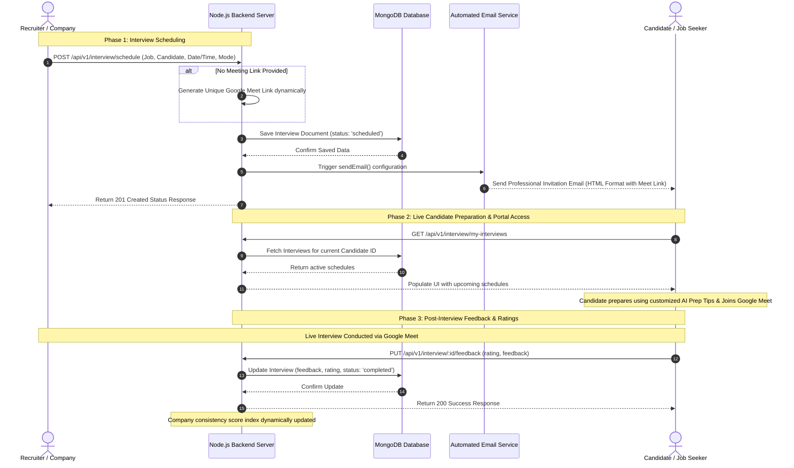

# Interview Scheduling & Candidate Feedback System
## End-to-End Workflow & Technical Architecture Documentation

This document defines the complete technical architecture and step-by-step workflow for the **Real-World Company Interview Scheduling & Interactive Rating System** implemented across the AI Job Portal platform.

---

## 🗺️ Architectural Workflow Diagram

The following sequence diagram outlines the interaction between the **Recruiter (Company)**, the **Backend Engine (Database & Email Service)**, and the **Candidate (Portal & Feedback)**.



---

## 🏢 1. Company / Recruiter Scheduling Workflow

When a recruiter decides to invite a job applicant for a live screening session:

### Step 1.1: Triggering the Schedule Action
1. The recruiter opens the **Hiring Dashboard** and navigates to the specific applicant's card.
2. They select the date, time window, and medium of interaction:
   * **In-Person**: Requires physical location.
   * **Zoom**: Uses Zoom meeting bindings.
   * **Google Meet**: Default video conferencing method.
3. The recruiter submits the scheduling form.

### Step 1.2: Backend Creation & Google Meet Link Generation
The client dispatches an HTTP request to the backend:
* **Route:** `POST /api/v1/interview/schedule`
* **Access Controller:** Private to authenticated users with the `recruiter` or `admin` roles.
* **Controller Logic (`scheduleInterview`):**
  1. Validates all mandatory fields (`jobId`, `candidateId`, `companyId`, `date`, `time`).
  2. If the mode is selected as `Google Meet` and no customized URL is specified, the controller dynamically generates a randomized unique Google Meet URL:
     ```javascript
     meetingLink: mode !== 'In-person' ? (meetingLink || `https://meet.google.com/${Math.random().toString(36).substring(7)}`) : null
     ```
  3. Records the document within the MongoDB database using the `Interview` schema.

### Step 1.3: Automated Candidate Notification
1. The system fetches the Candidate's contact credentials from the DB.
2. An automated HTML-formatted invitation email is dispatched to the candidate's verified email.
3. The email outlines the company name, the targeted job title, date, time, mode, and a direct clickable conference link.

---

## 👨‍💻 2. Candidate Preparation & Portal Engagement

Once notified, the Candidate logs into the job seeker cockpit to manage the session.

### Step 2.1: Navigating to the Interview Center
1. The candidate clicks the new **"Interviews"** (Calendar Icon) item registered inside their side navigation panel.
2. The page loads [InterviewsView.tsx](file:///d:/Artifact%20Geeks/githubworkspace/ai_job_portal/frontend/src/components/candidate/interviews/InterviewsView.tsx), requesting records via:
   * **Route:** `GET /api/v1/interview/my-interviews`
   * **Access Controller:** Private to authenticated candidates, isolating only their records.

### Step 2.2: Interacting with Upcoming Schedules
Within the **"Upcoming"** tab, scheduled cards are displayed dynamically:
* **Real-time Status indicator:** Highlights the interview state using a clean responsive tag.
* **Join Call Action:** Features a highly visible **"Join Google Meet"** gradient button, redirecting the candidate directly to the live call.
* **AI Prep Guidelines:** Includes a collapsible accordion containing customized prep advice generated for the specific role (e.g. key technical focus points, scale metrics, or preparation checklists).

---

## 🔄 3. Post-Interview Feedback Loop & Ratings

After completing the live interview, a feedback loop ensures the quality and consistency of the hiring process (complying with SRS Section 11.1).

### Step 3.1: Rating the Hiring Process
1. The candidate navigates to the **"Completed"** tab on the Interviews dashboard.
2. A prominent action labeled **"Share Experience & Rate Company"** is displayed for newly ended sessions.
3. Clicking this opens a frosted, glassmorphic overlay modal containing:
   * **Interactive Star Deck:** Features a 5-star rating matrix with hover animations.
   * **Detailed Feedback Input:** A textarea where candidates write comments on interview difficulty, interviewer punctuality, or questions asked.

### Step 3.2: Database Synchronization
Submitting the rating triggers a client service call:
* **Route:** `PUT /api/v1/interview/:id/feedback`
* **Payload Structure:**
  ```json
  {
    "feedback": "The interview panel was highly professional and asked excellent architectural questions.",
    "rating": 5
  }
  ```
* **Controller Execution (`submitInterviewFeedback`):**
  1. Validates that the star rating is provided.
  2. Confirms that the submitting user matches the `candidateId` recorded on the interview record.
  3. Updates the `Interview` document's rating and feedback fields.
  4. Automatically transitions the interview status to `'completed'`.
  5. The changes are saved permanently.

---

## 🛠️ Complete Technical Code References

| Layer | Target Code File | Function Name / Endpoint |
| :--- | :--- | :--- |
| **Backend Schema** | [Interview.js Model](file:///d:/Artifact%20Geeks/githubworkspace/ai_job_portal/backend/src/models/Interview.js) | Defines fields for `meetingLink`, `status`, `feedback`, and `rating`. |
| **Backend Logic** | [interviewController.js](file:///d:/Artifact%20Geeks/githubworkspace/ai_job_portal/backend/src/controllers/interviewController.js) | Includes `scheduleInterview`, `getMyInterviews`, and `submitInterviewFeedback`. |
| **Backend Routing** | [interviewRoutes.js](file:///d:/Artifact%20Geeks/githubworkspace/ai_job_portal/backend/src/routes/interviewRoutes.js) | Exposes `POST /schedule`, `GET /my-interviews`, and `PUT /:id/feedback`. |
| **Frontend API** | [interview.services.ts](file:///d:/Artifact%20Geeks/githubworkspace/ai_job_portal/frontend/src/lib/services/interview.services.ts) | Implements `scheduleInterview`, `getMyInterviews`, and `submitFeedback` methods. |
| **Frontend Layout** | [Sidebar.tsx Menu](file:///d:/Artifact%20Geeks/githubworkspace/ai_job_portal/frontend/src/components/candidate/layout/Sidebar.tsx) | Adds the "Interviews" navigation target. |
| **Frontend View** | [InterviewsView.tsx Component](file:///d:/Artifact%20Geeks/githubworkspace/ai_job_portal/frontend/src/components/candidate/interviews/InterviewsView.tsx) | Renders cards, meet links, tips, and the rating modal overlay. |
